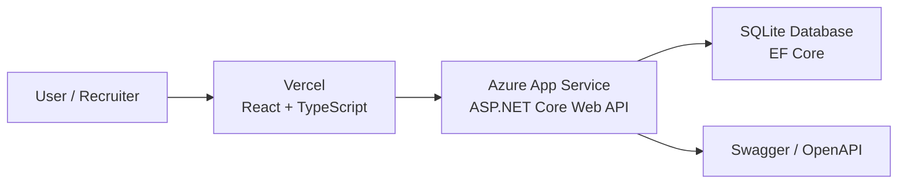

# RestaurantProject
[](https://github.com/Jegor2005/RestaurantProject/actions/workflows/dotnet.yml)

RestaurantProject is a full-stack restaurant network management application.

The project includes a .NET 8 ASP.NET Core Web API and a React + TypeScript frontend client. It supports CRUD operations for restaurants, menus, and dishes. The backend uses Entity Framework Core with SQLite, DTO-based API contracts, service layer architecture, validation, automatic migrations, seed data, Swagger documentation, HTTP logging, global error handling with ProblemDetails, automated tests, and GitHub Actions CI.

## Live Demo

Frontend client:

https://restaurant-project-omega-sand.vercel.app/

The live demo is public. Visitors can create, edit, and delete data. Use the **Reset demo data** button in the frontend to restore the original seed data.

API documentation:

https://restaurantnetwork-api-egor-ercmf9hrardshzhf.polandcentral-01.azurewebsites.net/swagger

Example API endpoint:

https://restaurantnetwork-api-egor-ercmf9hrardshzhf.polandcentral-01.azurewebsites.net/api/restaurants

Health check:

https://restaurantnetwork-api-egor-ercmf9hrardshzhf.polandcentral-01.azurewebsites.net/health

## Deployment Architecture



The frontend is deployed on Vercel and communicates with the ASP.NET Core API hosted on Azure App Service.

The API uses SQLite with Entity Framework Core. CORS is configured through Azure environment variables to allow the deployed frontend to call the backend.

The deployed demo also includes a reset endpoint that restores the original seed data.

## Technologies

* .NET 8
* ASP.NET Core Web API
* Entity Framework Core
* SQLite
* Swagger / OpenAPI
* DTOs
* Service Layer
* DataAnnotations validation
* ProblemDetails
* HTTP Logging
* xUnit
* EF Core SQLite in-memory testing
* Microsoft.AspNetCore.Mvc.Testing
* API integration testing
* React
* TypeScript
* Vite
* Axios
* GitHub Actions
* ESLint

## Main Features

* Manage restaurants
* Manage menus assigned to restaurants
* Manage dishes assigned to menus
* Use a React + TypeScript frontend client
* Create, edit, delete, and view restaurants from the UI
* Create, edit, delete, and view menus from the UI
* Create, edit, delete, and view dishes from the UI
* Validate incoming API requests
* Automatically apply EF Core migrations on startup
* Automatically seed initial data
* Explore and test endpoints through Swagger UI
* Filter dishes by category and price range
* Sort dishes by name, category, and price
* Use pagination for dish lists
* Service layer tests for restaurant, menu, and dish logic
* API integration tests for key endpoints

## Domain Model

The current MVP contains three main entities:


Restaurant
   └── Menu
          └── Dishes


A restaurant can have one menu.
A menu belongs to one restaurant.
A menu can contain many dishes.
Each dish belongs to one menu.

## Project Structure

```text
RestaurantProject
├── RestaurantNetwork.Api
│   ├── Controllers
│   │   ├── RestaurantsController.cs
│   │   ├── MenusController.cs
│   │   └── DishesController.cs
│   │
│   ├── Data
│   │   ├── AppDbContext.cs
│   │   ├── DbSeeder.cs
│   │   └── Migrations
│   │
│   ├── DTO
│   │   ├── RestaurantDto.cs
│   │   ├── CreateRestaurantDto.cs
│   │   ├── UpdateRestaurantDto.cs
│   │   ├── MenuDto.cs
│   │   ├── CreateMenuDto.cs
│   │   ├── UpdateMenuDto.cs
│   │   ├── DishDto.cs
│   │   ├── CreateDishDto.cs
│   │   ├── UpdateDishDto.cs
│   │   ├── DishQueryDto.cs
│   │   └── PagedResultDto.cs
│   │
│   ├── Services
│   │   ├── IRestaurantService.cs
│   │   ├── RestaurantService.cs
│   │   ├── IMenuService.cs
│   │   ├── MenuService.cs
│   │   ├── IDishService.cs
│   │   └── DishService.cs
│   │
│   └── Program.cs
│
├── RestaurantProject.DataModel
│   ├── Restaurant.cs
│   ├── Menu.cs
│   └── Dish.cs
│
├── RestaurantNetwork.Api.Tests
│   ├── ApiIntegrationTests.cs
│   ├── RestaurantServiceTests.cs
│   ├── MenuServiceTests.cs
│   └── DishServiceTests.cs
│
├── restaurant-client
│   ├── src
│   │   ├── api
│   │   ├── types
│   │   ├── utils
│   │   ├── App.tsx
│   │   └── main.tsx
│   │
│   ├── package.json
│   └── vite.config.ts
│
└── .github
    └── workflows
        └── dotnet.yml
```

### Domain models are stored in:


RestaurantProject.DataModel

## Tests

The solution contains a test project:

```text
RestaurantNetwork.Api.Tests
```

The project includes service tests and API integration tests.

### Service Tests

Current service tests cover:

```text
RestaurantService
- creating a restaurant
- updating an existing restaurant
- returning false when updating a missing restaurant
- deleting an existing restaurant

MenuService
- checking if a restaurant exists
- checking if a restaurant has a menu
- creating a menu for an existing restaurant
- deleting an existing menu

DishService
- pagination
- category filtering
- price sorting
- dish creation for an existing menu
- updating an existing dish
- returning false when updating a missing dish
- deleting an existing dish
- returning false when deleting a missing dish
```

Service tests use SQLite in-memory database to verify EF Core behavior close to the real application database.

### API Integration Tests

Integration tests verify the API through real HTTP requests using `WebApplicationFactory`.

Current integration tests cover:

```text
GET /api/restaurants
GET /api/dishes?pageNumber=1&pageSize=5
GET /api/dishes/999
```

These tests check the full request flow:

```text
HTTP request → Controller → Service → EF Core → SQLite in-memory → HTTP response
```

### Running Tests

To run tests in Visual Studio:

```text
Test → Run All Tests
```

Or using .NET CLI:

```bash
dotnet test
```

## Continuous Integration

The project uses GitHub Actions to automatically run build and tests on every push and pull request to the `master` branch.

The workflow runs:


```text
dotnet restore
dotnet build
dotnet test
npm ci
npm run lint
npm run build
```

## API Endpoints

### Restaurants


GET    /api/restaurants
GET    /api/restaurants/{id}
POST   /api/restaurants
PUT    /api/restaurants/{id}
DELETE /api/restaurants/{id}


### Menus

GET    /api/menus
GET    /api/menus/{id}
GET    /api/restaurants/{restaurantId}/menu
POST   /api/restaurants/{restaurantId}/menu
PUT    /api/menus/{id}
DELETE /api/menus/{id}


### Dishes


GET    /api/dishes
GET    /api/dishes/{id}
GET    /api/dishes?category=Salad
GET    /api/dishes?minPrice=8&maxPrice=12
GET    /api/dishes?sortBy=price&sortDirection=desc
GET    /api/dishes?pageNumber=1&pageSize=5
GET    /api/menus/{menuId}/dishes
POST   /api/menus/{menuId}/dishes
PUT    /api/dishes/{id}
DELETE /api/dishes/{id}


## Example Requests

### Create Restaurant

```json
{
  "color": "Red",
  "address": "Maribor, Slovenia",
  "rent": 1200
}
```

### Create Menu for Restaurant

```json
{
  "name": "Main Menu",
  "description": "Default restaurant menu"
}
```


### Create Dish for Menu

```json
{
  "name": "Classic Burger",
  "price": 12.5,
  "category": "Main Course",
  "description": "Burger with beef, cheese and sauce"
}
```

Dish Query Options

The GET /api/dishes endpoint supports filtering, sorting, and pagination.

Filtering

Filter dishes by category:

GET /api/dishes?category=Salad

Filter dishes by price range:

GET /api/dishes?minPrice=8&maxPrice=12
Sorting

Sort dishes by name, category, or price:

GET /api/dishes?sortBy=price&sortDirection=desc

Supported sortBy values:

name
category
price

Supported sortDirection values:

asc
desc
Pagination
GET /api/dishes?pageNumber=1&pageSize=5

The response contains:

{
  "items": [],
  "totalCount": 9,
  "pageNumber": 1,
  "pageSize": 5,
  "totalPages": 2
}
#### Combined Example
GET /api/dishes?category=Main%20Course&minPrice=8&sortBy=price&sortDirection=asc&pageNumber=1&pageSize=3


## How to Run

### Requirements

```text
.NET 8 SDK
Node.js 20+
npm
```

### Run with Visual Studio

1. Clone the repository.
2. Open the solution in Visual Studio.
3. Set `RestaurantNetwork.Api` as the startup project.
4. Run the project.
5. Open Swagger UI in the browser.

### Run with .NET CLI

Clone the repository:

```bash
git clone https://github.com/Jegor2005/RestaurantProject.git
cd RestaurantProject
```

Restore dependencies:

```bash
dotnet restore
```

Build the solution:

```bash
dotnet build
```

Run the API:

```bash
dotnet run --project RestaurantNetwork.Api
```

Run the frontend client:

```bash
cd restaurant-client
npm install
npm run dev
```

Run tests:

```bash
dotnet test
```


### Frontend Environment Variables

The frontend can use an environment variable to point to a deployed API:

```env
VITE_API_BASE_URL=https://your-api-url.azurewebsites.net/api
```

For local development, this variable can be omitted because Vite proxy forwards `/api` requests to the local backend.

The application uses SQLite. The database file is created automatically when the project starts.

Migrations are applied automatically on startup, and seed data is inserted if the database is empty.

## Database

The project uses Entity Framework Core with SQLite.

Connection string example:

```json
{
  "ConnectionStrings": {
    "Default": "Data Source=restaurantproject.db"
  }
}
```


Migrations are applied automatically on startup.

Seed data is also inserted automatically if the database is empty.

The seed includes:

* restaurants
* menus
* dishes

## Validation

The API uses DTOs and DataAnnotations validation.

Examples of validation rules:

* required fields
* maximum string length
* valid price range
* valid rent range

Invalid requests return `400 Bad Request`.

## Error Handling

The project uses ASP.NET Core ProblemDetails for global error handling.

Common responses:


- 200 OK
- 201 Created
- 204 No Content
- 400 Bad Request
- 404 Not Found
- 409 Conflict
- 500 Internal Server Error


## Future Improvements

Possible next improvements:
* more service tests
* more API integration tests
* authentication and authorization
* Docker support
* order management
* staff management
* deployment

## Current Status

The current version is a full-stack MVP with a .NET Web API backend and a React + TypeScript frontend client.

Implemented:

* Restaurant CRUD
* Menu CRUD
* Dish CRUD
* Restaurant → Menu relationship
* Menu → Dishes relationship
* EF Core migrations
* SQLite database
* seed data
* Swagger documentation
* DTOs
* validation
* service layer
* HTTP logging
* ProblemDetails error handling
* React + TypeScript frontend client
* frontend linting
* frontend production build
* GitHub Actions CI for backend and frontend
